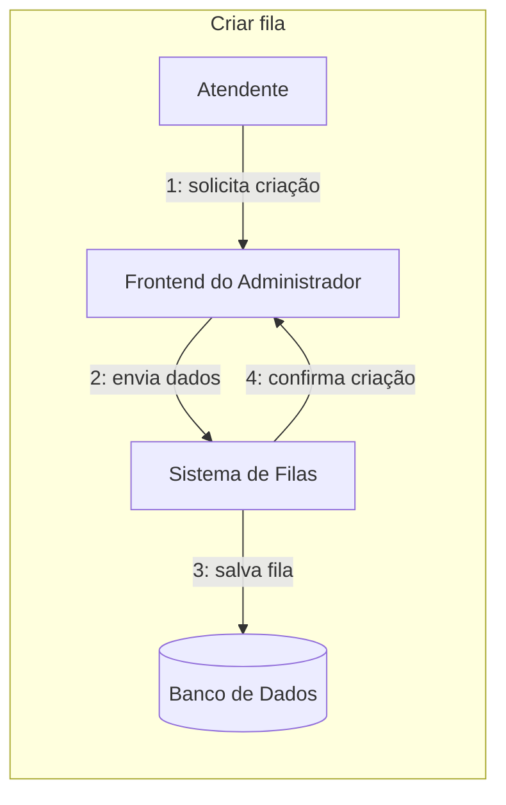
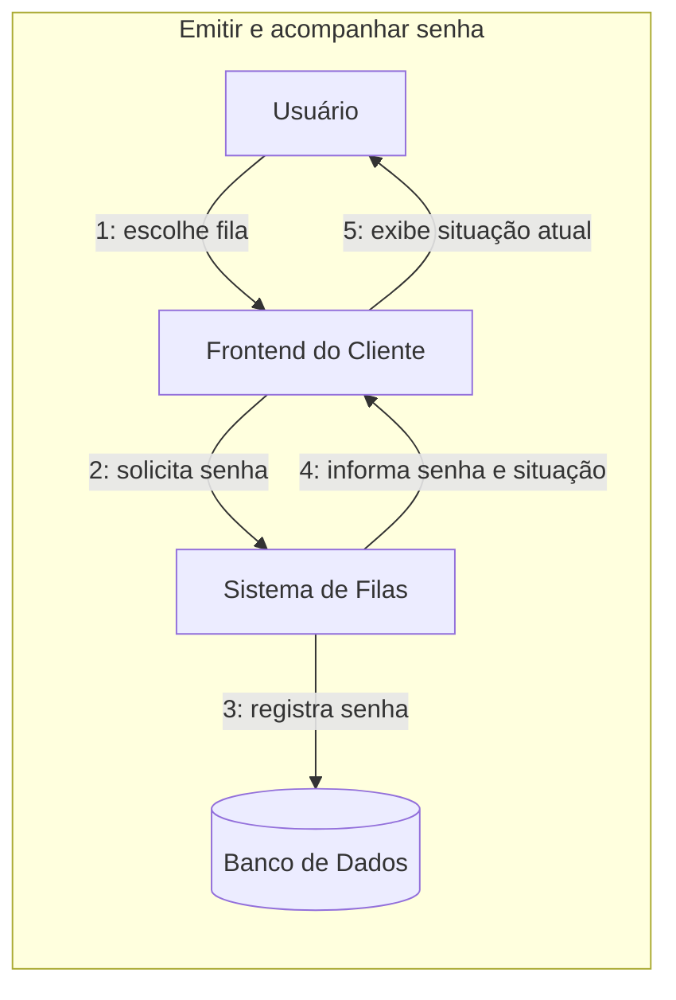
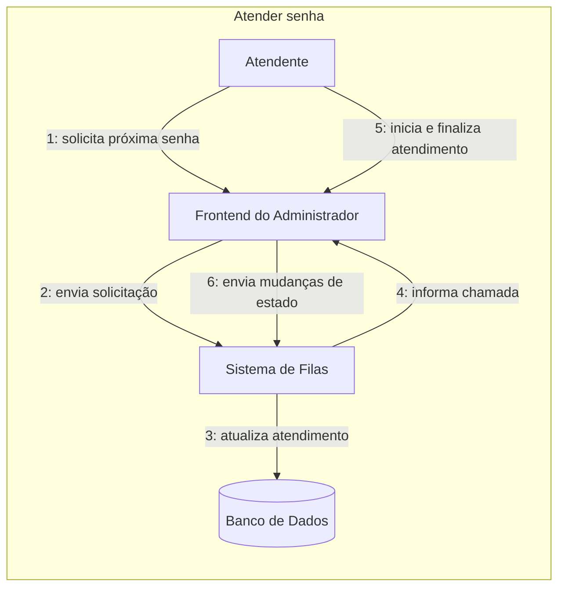
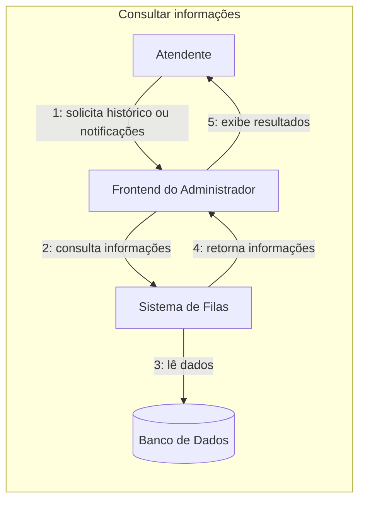

# Diagrama de Comunicação

Este diagrama resume a comunicação entre os atores e os principais
componentes do sistema de filas.

```mermaid
flowchart LR
    Atendente[Atendente]
    FrontendAdmin[Frontend do Administrador]
    Sistema[Sistema de Filas]
    Banco[(Banco de Dados)]

    subgraph F1[Criar fila]
        Atendente -->|1: solicita criação| FrontendAdmin
        FrontendAdmin -->|2: envia dados| Sistema
        Sistema -->|3: salva fila| Banco
        Sistema -->|4: confirma criação| FrontendAdmin
    end
```

```mermaid
flowchart LR
    Usuario[Usuário]
    FrontendCliente[Frontend do Cliente]
    Sistema[Sistema de Filas]
    Banco[(Banco de Dados)]

    subgraph F2[Emitir e acompanhar senha]
        Usuario -->|1: escolhe fila| FrontendCliente
        FrontendCliente -->|2: solicita senha| Sistema
        Sistema -->|3: registra senha| Banco
        Sistema -->|4: informa senha e situação| FrontendCliente
        FrontendCliente -->|5: exibe situação atual| Usuario
    end
```

```mermaid
flowchart LR
    Atendente[Atendente]
    FrontendAdmin[Frontend do Administrador]
    Sistema[Sistema de Filas]
    Banco[(Banco de Dados)]

    subgraph F3[Atender senha]
        Atendente -->|1: solicita próxima senha| FrontendAdmin
        FrontendAdmin -->|2: envia solicitação| Sistema
        Sistema -->|3: atualiza atendimento| Banco
        Sistema -->|4: informa chamada| FrontendAdmin
        Atendente -->|5: inicia e finaliza atendimento| FrontendAdmin
        FrontendAdmin -->|6: envia mudanças de estado| Sistema
    end
```

```mermaid
flowchart LR
    Atendente[Atendente]
    FrontendAdmin[Frontend do Administrador]
    Sistema[Sistema de Filas]
    Banco[(Banco de Dados)]

    subgraph F4[Consultar informações]
        Atendente -->|1: solicita histórico ou notificações| FrontendAdmin
        FrontendAdmin -->|2: consulta informações| Sistema
        Sistema -->|3: lê dados| Banco
        Sistema -->|4: retorna informações| FrontendAdmin
        FrontendAdmin -->|5: exibe resultados| Atendente
    end
```
