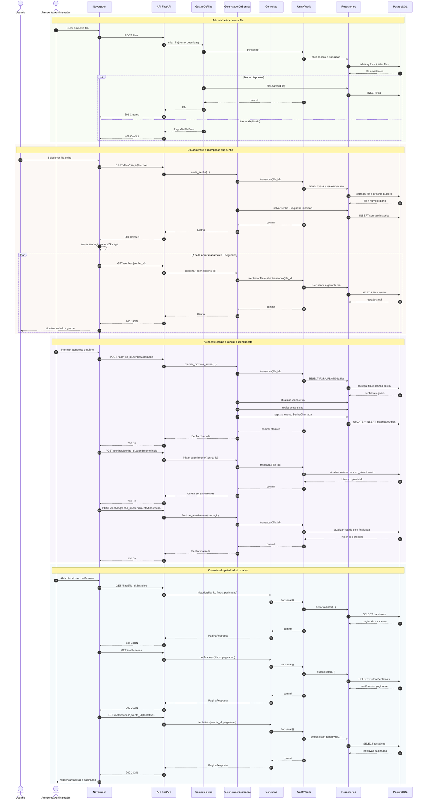

# Diagrama de Sequência

```mermaid
sequenceDiagram
    autonumber
    actor Usuario
    actor Atendente as Atendente/Administrador
    participant Browser as Navegador
    participant API as API FastAPI
    participant Filas as GestaoDeFilas
    participant Senhas as GerenciadorDeSenhas
    participant Consultas as Consultas
    participant UoW as UnitOfWork
    participant Repositorios as Repositorios
    participant Postgres as PostgreSQL

    rect rgb(248, 252, 245)
        Note over Atendente,Postgres: Administrador cria uma fila
        Atendente->>Browser: Clicar em Nova fila
        Browser->>API: POST /filas
        API->>Filas: criar_fila(nome, descricao)
        Filas->>UoW: transacao()
        UoW->>Repositorios: abrir sessao e transacao
        Repositorios->>Postgres: advisory lock + listar filas
        Postgres-->>Repositorios: filas existentes
        alt Nome disponivel
            Filas->>Repositorios: filas.salvar(Fila)
            Repositorios->>Postgres: INSERT fila
            UoW-->>Filas: commit
            Filas-->>API: Fila
            API-->>Browser: 201 Created
        else Nome duplicado
            Filas-->>API: RegraDeFilaError
            API-->>Browser: 409 Conflict
        end
    end

    rect rgb(252, 248, 245)
        Note over Usuario,Postgres: Usuário emite e acompanha sua senha
        Usuario->>Browser: Selecionar fila e tipo
        Browser->>API: POST /filas/{fila_id}/senhas
        API->>Senhas: emitir_senha(...)
        Senhas->>UoW: transacao(fila_id)
        UoW->>Repositorios: SELECT FOR UPDATE da fila
        Repositorios->>Postgres: carregar fila e proximo numero
        Postgres-->>Repositorios: fila + numero diario
        Senhas->>Repositorios: salvar senha + registrar transicao
        Repositorios->>Postgres: INSERT senha e historico
        UoW-->>Senhas: commit
        Senhas-->>API: Senha
        API-->>Browser: 201 Created
        Browser->>Browser: salvar senha_id no localStorage

        loop A cada aproximadamente 3 segundos
            Browser->>API: GET /senhas/{senha_id}
            API->>Senhas: consultar_senha(senha_id)
            Senhas->>UoW: identificar fila e abrir transacao(fila_id)
            UoW->>Repositorios: reler senha e garantir dia
            Repositorios->>Postgres: SELECT fila e senha
            Postgres-->>Repositorios: estado atual
            UoW-->>Senhas: commit
            Senhas-->>API: Senha
            API-->>Browser: 200 JSON
            Browser-->>Usuario: atualizar estado e guiche
        end
    end

    rect rgb(248, 245, 252)
        Note over Atendente,Postgres: Atendente chama e conclui o atendimento
        Atendente->>Browser: Informar atendente e guiche
        Browser->>API: POST /filas/{fila_id}/senhas/chamada
        API->>Senhas: chamar_proxima_senha(...)
        Senhas->>UoW: transacao(fila_id)
        UoW->>Repositorios: SELECT FOR UPDATE da fila
        Repositorios->>Postgres: carregar fila e senhas do dia
        Postgres-->>Repositorios: senhas elegiveis
        Senhas->>Repositorios: atualizar senha e fila
        Senhas->>Repositorios: registrar transicao
        Senhas->>Repositorios: registrar evento SenhaChamada
        Repositorios->>Postgres: UPDATE + INSERT historico/Outbox
        UoW-->>Senhas: commit atomico
        Senhas-->>API: Senha chamada
        API-->>Browser: 200 OK

        Browser->>API: POST /senhas/{senha_id}/atendimento/inicio
        API->>Senhas: iniciar_atendimento(senha_id)
        Senhas->>UoW: transacao(fila_id)
        UoW->>Postgres: atualizar estado para em_atendimento
        Postgres-->>UoW: historico persistido
        UoW-->>Senhas: commit
        Senhas-->>API: Senha em atendimento
        API-->>Browser: 200 OK

        Browser->>API: POST /senhas/{senha_id}/atendimento/finalizacao
        API->>Senhas: finalizar_atendimento(senha_id)
        Senhas->>UoW: transacao(fila_id)
        UoW->>Postgres: atualizar estado para finalizada
        Postgres-->>UoW: historico persistido
        UoW-->>Senhas: commit
        Senhas-->>API: Senha finalizada
        API-->>Browser: 200 OK
    end

    rect rgb(245, 250, 252)
        Note over Atendente,Postgres: Consultas do painel administrativo
        Atendente->>Browser: Abrir historico ou notificacoes
        Browser->>API: GET /filas/{fila_id}/historico
        API->>Consultas: historico(fila_id, filtros, paginacao)
        Consultas->>UoW: transacao()
        UoW->>Repositorios: historico.listar(...)
        Repositorios->>Postgres: SELECT transicoes
        Postgres-->>Repositorios: pagina de transicoes
        UoW-->>Consultas: commit
        Consultas-->>API: PaginaResposta
        API-->>Browser: 200 JSON

        Browser->>API: GET /notificacoes
        API->>Consultas: notificacoes(filtros, paginacao)
        Consultas->>UoW: transacao()
        UoW->>Repositorios: outbox.listar(...)
        Repositorios->>Postgres: SELECT Outbox/tentativas
        Postgres-->>Repositorios: notificacoes paginadas
        UoW-->>Consultas: commit
        Consultas-->>API: PaginaResposta
        API-->>Browser: 200 JSON

        Browser->>API: GET /notificacoes/{evento_id}/tentativas
        API->>Consultas: tentativas(evento_id, paginacao)
        Consultas->>UoW: transacao()
        UoW->>Repositorios: outbox.listar_tentativas(...)
        Repositorios->>Postgres: SELECT tentativas
        Postgres-->>Repositorios: tentativas paginadas
        UoW-->>Consultas: commit
        Consultas-->>API: PaginaResposta
        API-->>Browser: 200 JSON
        Browser-->>Atendente: renderizar tabelas e paginacao
    end
```